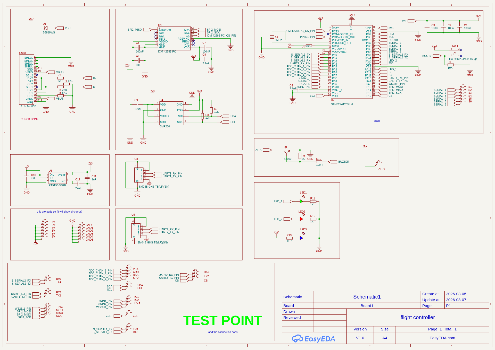

# Flight Controller
---

This is a compact, custom-designed flight controller project based on the STM32 architecture. It is designed for high-performance motion tracking and stable flight processing.

## Hardware Specifications

core processing
- MCU: STM32F412CEU6
- Clock: 8MHz External Resonator

Sensors
- IMU: ICM-42688-PC (High-precision 6-axis motion tracking)
- Barometer: BMP280 (For altitude sensing and pressure monitoring)

Power & Connectivity
- Input: USB-C (C16PIN) for programming and power.
- Regulation: RT9193-33GB (U6) 3.3V Low-Dropout (LDO) regulator.
- Connectors: JST SH 1.0mm for peripheral communication.

## Design Details
- Software Used: EasyEDA
- Component Size: Primarily 0603 SMD for a balance between compact size and hand-solderability.

## Hardware size

## schemetic img

## Getting Started

1. Open the `.epro` file in EasyEDA or compatible software.
2. Review the schematics and PCB layouts in the `production/` folder.
- `flight controller.epro`: Main project file
- `production/`: Production-related files

3.Download and install the STM32CubeProgrammer or the Betaflight Configurator.

4.If using Betaflight, go to the Firmware Flasher tab.

5.Select the correct target for the STM32F412 processor.

## Contributing

Feel free to contribute improvements or bug fixes.# flight-controller
